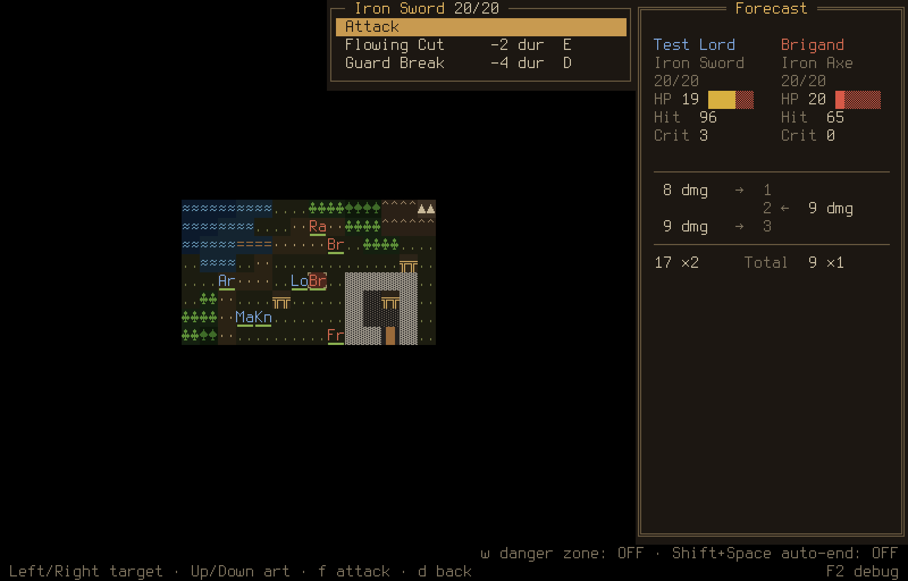
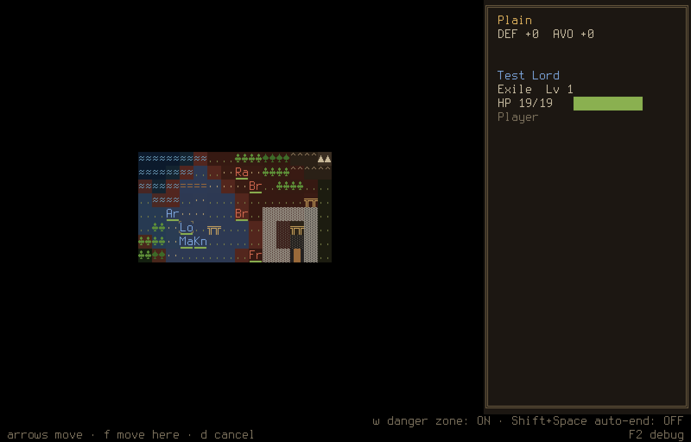
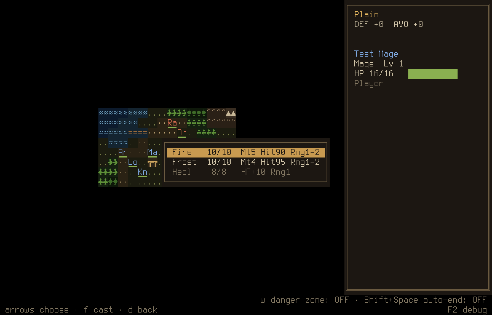
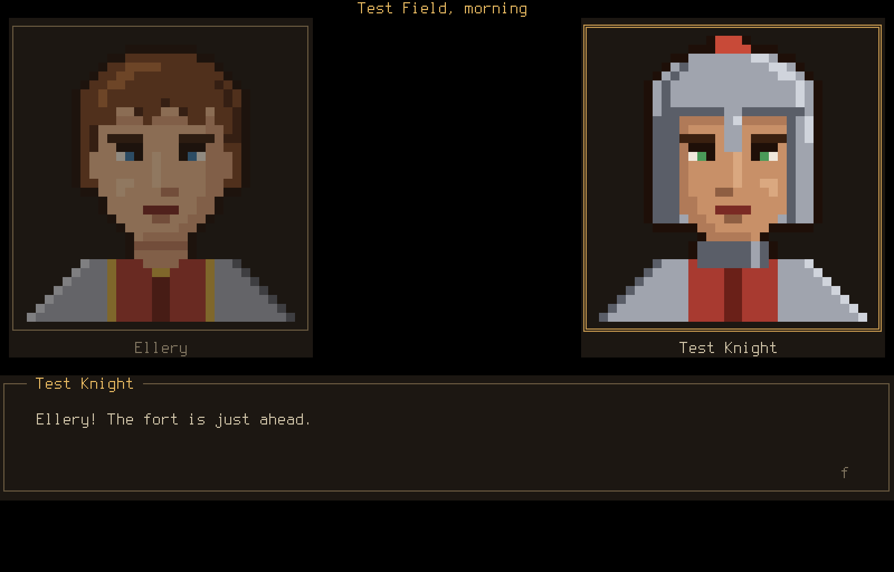
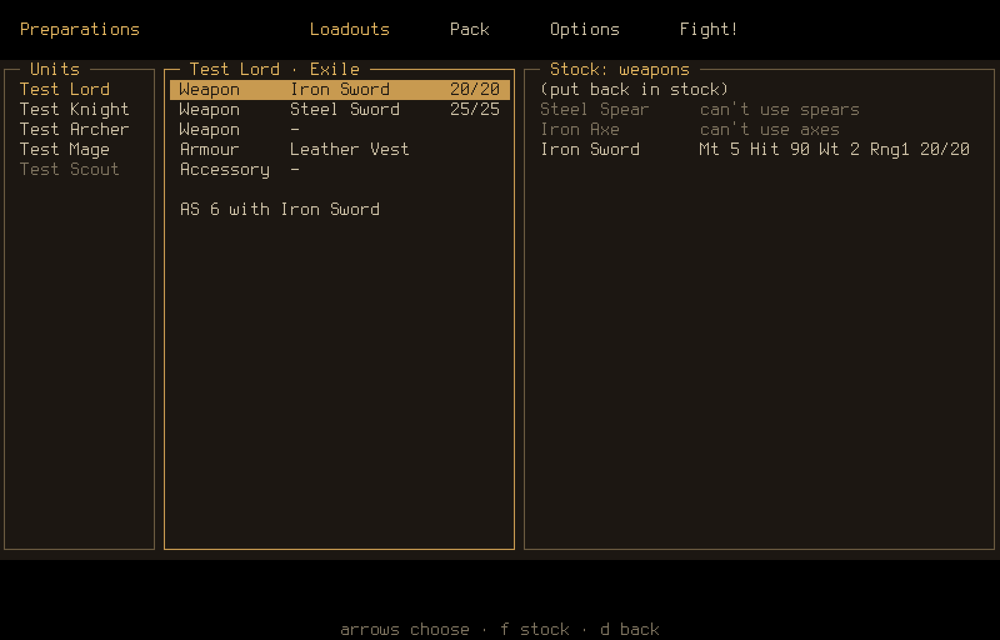
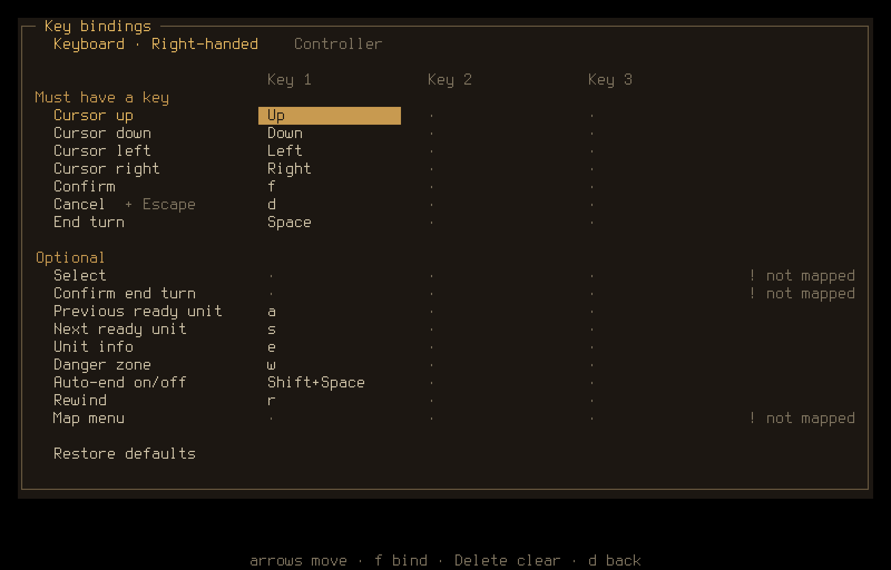
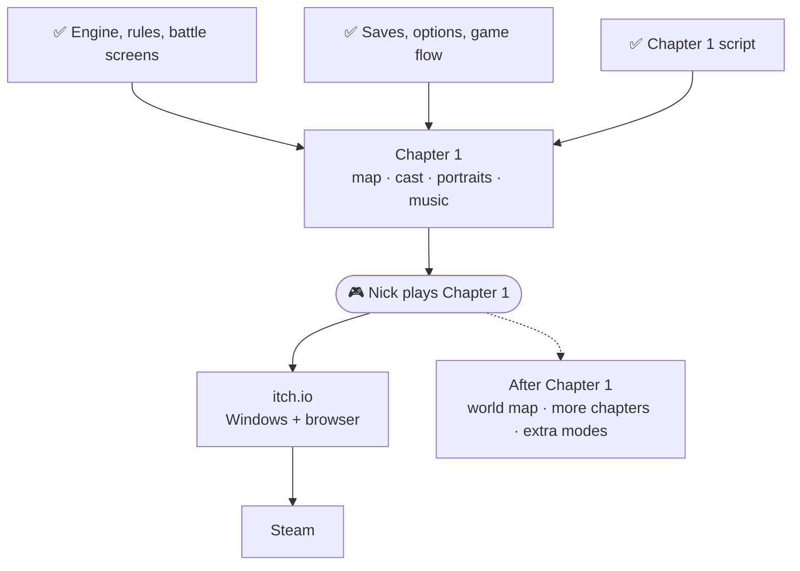
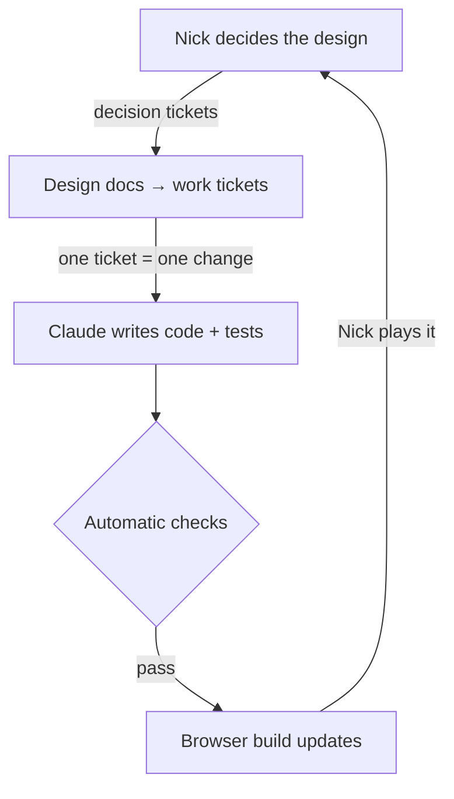

# Visions of Shuyi

**A tactical RPG you can play entirely from the keyboard.**
*Fire Emblem's battles, a roguelike's glyphs or pixel art, a text editor's hands.*

[**▶ Play the latest build in your browser**](https://zafnok.github.io/visions-of-shuyi/)
&nbsp;·&nbsp; [Roadmap](docs/ROADMAP.md)
&nbsp;·&nbsp; [Backlog](tickets/README.md)
&nbsp;·&nbsp; [Design decisions](docs/design/README.md)

## What it is

A turn-based tactics game in the spirit of Fire Emblem. You play it entirely
from the keyboard (or a controller): a cursor on the map, vim-style movement
by default or a left-handed layout, one hand steering and one hand acting.
Every key and button can be rebound.

- **Setting and tone:** a medieval fantasy war between European-style
  kingdoms, in a world with other continents that feel different. Dark, with
  warmth and humour in between (think *Path of Radiance* and *Triangle
  Strategy*). It ends in a hard-fought victory, not a tragedy.
- **Your lead:** a disgraced, exiled young noble, with a gender you choose
  and a class line of their own.
- **Battles:** weapon durability and Combat Arts, spells that set forests on
  fire or freeze rivers, class skills, and a limited number of turn rewinds
  per map. Classic mode (fallen units are gone) or Casual.
- **Between battles:** level ups, promotions and class changes, supports
  earned by fighting side by side, and dialogue scenes with two portraits on
  screen.
- **Two looks:** the game started as coloured glyphs, like Dwarf Fortress or
  Rogue. It now also has hand-made pixel art (portraits, map tiles and unit
  sprites that walk), and the glyph look will stay as an option.

<table>
<tr>
<td width="50%"></td>
<td width="50%"></td>
</tr>
<tr>
<td align="center">Move and attack ranges, with the enemy danger zone</td>
<td align="center">Spells</td>
</tr>
<tr>
<td width="50%"></td>
<td width="50%"></td>
</tr>
<tr>
<td align="center">Dialogue scenes</td>
<td align="center">Preparations: loadouts and the shared pack</td>
</tr>
</table>

These pictures show the glyph look with test units and placeholder
portraits. The pixel art was bought and is not part of this repository, so
it is only shown in the game itself:
[the browser build](https://zafnok.github.io/visions-of-shuyi/) uses it.

## What you can play today

**Pre-alpha.** The [browser build](https://zafnok.github.io/visions-of-shuyi/)
is rebuilt after every change. It has two ways in:

- **New Game** runs the whole loop on a short test chapter: pick Classic or
  Casual, pick your lead, watch the opening scene, win the battle, see the
  results, save, and carry on.
- **Quick Battle** drops you into a test battle through the Preparations
  screen.

In a battle you can:

- move units with the cursor, see move and attack ranges and the enemy danger
  zone, and read terrain and unit info;
- attack with a full forecast (hit, crit, damage, doubling, counters) and
  watch the exchange play out;
- cast spells, including ones that burn forest or freeze water;
- use Combat Arts, class skills, potions and gear, and swap weapons;
- rewind a turn when a move goes wrong;
- fight enemies that fight back, with a boss that uses arts and skills, and
  watch their turn play out;
- earn EXP, level up, promote and change class;
- trigger dialogue on the battlefield: boss lines, last words, and *Talk*;
- read battle notes with the objective and hints.

Around the battles there is saving and loading (with a suspend save in the
middle of a battle), an options menu, rebinding for keys and controller
buttons, a credits screen, and music and sound throughout.

<table>
<tr>
<td width="50%"></td>
<td width="50%" valign="top">

**Not in yet**

- The real Chapter 1: its map, its cast with their portraits, and its
  script in the game. The script is written; today's build plays a test
  chapter with test units.
- The full-body art for the close-up combat scene.
- Victory, defeat and Game Over music.
- Shops and villages on the map.

</td>
</tr>
</table>

### Progress

*As of 2026-10-04. Work is tracked as tickets in [`tickets/`](tickets/README.md);
the numbers below count finished tickets out of all tickets written so far.*

| Area | Progress | Done |
| ---- | -------- | ---: |
| Game-design decisions | `██████████░░░░░░░░░░` | 28 / 54 |
| Project foundation | `████████████████████` | 21 / 21 |
| Engine: drawing, input, audio | `████████████████░░░░` | 34 / 43 |
| Battle rules | `███████████████████░` | 15 / 16 |
| Battle screens | `████████████████░░░░` | 35 / 45 |
| Enemy AI and playtest bots | `█████████░░░░░░░░░░░` | 5 / 11 |
| Level ups and classes | `█████████████░░░░░░░` | 4 / 6 |
| Story and dialogue | `█████████████░░░░░░░` | 17 / 26 |
| Chapter 1 and game flow | `█████████░░░░░░░░░░░` | 12 / 28 |
| Release | `██████░░░░░░░░░░░░░░` | 2 / 7 |
| **Total** | `█████████████░░░░░░░` | **174 / 258** |

The bars look emptier than Chapter 1 really is: many of the open tickets
are for things planned after it (other languages, voices, the title's intro
cinematic, replay modes). What stands between today and a playable
Chapter 1 is the short list below.

## Roadmap

### Next: a complete Chapter 1

One story battle (rout the enemy) with six units including the lead, hints
that appear when you need them, and a full opening scene. What is left:

1. **The cast's portraits** and the **full-body art** for the close-up
   combat scene.
2. **The Chapter 1 map and units**, put together with the script that is
   already written.
3. **End-of-battle music:** a victory sting, a defeat sting and a Game Over
   track.
4. **A second chance on Game Over:** rewind instead of losing, while you
   have rewinds left.
5. **Nick plays it start to finish.** His feedback becomes the next tickets.

### Then: release

itch.io first (Windows and browser), then Linux and macOS builds, then
Steam.

### Planned after Chapter 1

- **A world map** in the style of *The Sacred Stones*: travel between
  places, towns and a camp, with fixed and random skirmishes.
- **Support conversations** between units who fight side by side, and camp
  scenes.
- **Shops, villages to visit and chests** on the battle map.
- **Reasons to replay:** star ratings with optional challenges on each
  battle, and optional "Visions" that trade a drawback for a reward on
  random skirmishes.
- **Extra modes:** Ironman, a roguelike run mode with its own saves, and a
  randomizer.
- **Replays and sharing:** watch a battle back, or compare yourself with a
  veteran's run.
- **Other languages:** Japanese and Simplified Chinese.
- **Voiced dialogue**, with an off switch.
- **An intro cinematic** on the title screen, cut to the title music.
- **More to look at:** per-map lighting, map zoom, colour themes and a
  colour-blind palette, screen transitions, and a choice between pixel art
  and glyphs.
- **Modding:** a mods folder, a map editor, and player-made campaigns.
- **More game:** more chapters and continents, higher class tiers, and
  difficulty modes.
- **Multiplayer**, after the single-player game is out.

The translations and voices will be machine-made at first and built so that
people can replace them later; the game will say which parts are
machine-made. The full plan, in dependency order, is in
[`docs/ROADMAP.md`](docs/ROADMAP.md).

## How it's built

One unusual thing about this project: **Nick designs the game, Claude (an AI)
writes the code**, and the tests are the code review.

It is written in Rust and runs as a Windows program and in the browser from
the same code. The rules of the game are kept separate from how it looks,
which is what makes turn rewind, the playtest bots and the two looks
possible.

| Where | What |
| ----- | ---- |
| [`tickets/`](tickets/README.md) | The backlog. Each ticket is a Markdown file; finished ones move to `tickets/done/` |
| [`docs/ROADMAP.md`](docs/ROADMAP.md) | Milestones and the path to a playable Chapter 1 |
| [`docs/design/`](docs/design/README.md) | Game-design decisions, made by Nick |
| [`docs/story/`](docs/story/README.md) | Story beats, bible and characters (spoilers!) |
| [`docs/adr/`](docs/adr/README.md) | Technical decisions |
| [`docs/releasing.md`](docs/releasing.md) | How a release is cut |
| [`crates/`](crates) | The code |
| [`CLAUDE.md`](CLAUDE.md) + [`.claude/skills/`](.claude/skills) | Instructions for the AI sessions that build the game |

## License

**Source-available, not open source.** Copyright (c) 2026 Nick Wentz, all
rights reserved. You may read and learn from the code, use it in
non-commercial teaching, make free non-commercial mods, and stream or post
videos of the game (monetised is fine). You may not redistribute or sell it or
games made from it. See [`LICENSE`](LICENSE) for the exact terms, and
[`THIRD_PARTY_ASSETS.md`](THIRD_PARTY_ASSETS.md) for third-party material.
